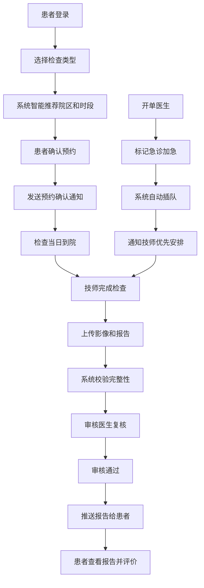

## 1. 产品概述

本平台是一个大型综合医院的多院区医技检查预约与报告分发管理系统，旨在解决多院区环境下检查资源分配不均、患者等待时间长、报告流转效率低等问题。通过智能化调度和全流程数字化管理，提升医疗服务质量和患者满意度。

- 核心目标：实现检查资源优化配置、缩短患者等待时间、提高报告流转效率、辅助管理层科学决策
- 目标用户：患者、开单医生、检查技师、科室主任、院领导
- 市场价值：提升医院运营效率，改善患者就医体验，为医院管理提供数据支撑

## 2. 核心功能

### 2.1 用户角色

| 角色 | 登录方式 | 核心权限 |
|------|----------|----------|
| 患者 | 手机号/身份证号登录 | 在线预约检查、查看报告、满意度评价、接收通知 |
| 开单医生 | 工号登录 | 查看预约列表、标记急诊加急、查看报告状态 |
| 检查技师 | 工号登录 | 查看检查队列、上传影像和报告、接收加急通知 |
| 科室主任 | 工号登录 | 查看设备统计、设置检查容量、查看满意度排名 |
| 院领导 | 工号登录 | 查看全院统计、查看运营报告、查看收入分布 |

### 2.2 功能模块

1. **登录与角色选择**：用户身份认证，根据角色展示不同功能界面
2. **智能预约系统**：患者选择检查类型，系统自动推荐最优院区和时间段
3. **急诊加急处理**：开单医生标记急诊，系统自动插队并通知技师
4. **检查报告管理**：技师上传报告、审核医生复核、自动推送给患者
5. **数据可视化中心**：设备使用率、排队时长、检查量趋势等多维度图表
6. **满意度评价系统**：患者打分，自动生成技师服务排名
7. **运营报告系统**：每月自动生成运营报告并推送给院领导
8. **实时消息推送**：预约确认、加急提醒、报告完成、复检通知

### 2.3 页面详情

| 页面名称 | 模块名称 | 功能描述 |
|----------|----------|----------|
| 登录页 | 身份认证 | 账号密码登录、角色选择、忘记密码 |
| 患者首页 | 预约中心 | 检查类型选择、院区推荐、时间段选择 |
| 患者首页 | 我的预约 | 预约列表、取消预约、查看详情 |
| 患者首页 | 报告中心 | 报告列表、查看报告、下载凭证 |
| 患者首页 | 满意度评价 | 检查体验打分、提交评价 |
| 医生首页 | 预约列表 | 全部预约、急诊标记、筛选搜索 |
| 医生首页 | 患者详情 | 患者信息、检查历史、加急操作 |
| 技师首页 | 检查队列 | 待检查列表、加急优先、状态更新 |
| 技师首页 | 报告上传 | 影像上传、报告编辑、提交审核 |
| 主任首页 | 设备监控 | 各院区设备使用率、排队时长对比图 |
| 主任首页 | 容量设置 | 每日检查容量上限设置 |
| 主任首页 | 满意度排名 | 技师服务满意度排行榜 |
| 院领导首页 | 全局概览 | 月度检查量趋势图、收入分布饼图 |
| 院领导首页 | 运营报告 | 月度运营报告、历史报告查阅 |
| 通知中心 | 消息列表 | 各类通知消息、消息详情、标记已读 |

## 3. 核心流程

### 3.1 患者预约检查流程
患者选择检查类型 → 系统分析各院区设备忙闲度和排队人数 → 智能推荐最优院区及时间段 → 患者确认预约 → 系统发送预约确认通知 → 检查当日患者到院 → 技师完成检查 → 上传报告并审核 → 报告完成通知患者 → 患者查看报告并评价

### 3.2 急诊加急流程
开单医生查看预约列表 → 选择急诊患者 → 标记加急 → 系统自动插入队列前部 → 推送加急通知给技师 → 技师优先安排检查 → 完成后快速出报告

### 3.3 报告审核流程
技师上传影像和报告 → 系统自动校验报告完整性 → 推送审核医生复核 → 审核通过 → 系统更新状态 → 推送报告链接给患者 → 患者查看下载

### 3.4 运营报告生成流程
每月1号零点 → 系统自动统计各院区数据（检查完成量、平均等待时间、复检率、设备故障次数）→ 生成运营报告 → 推送到院领导手机端 → 院领导查看报告

## 4. 用户界面设计

### 4.1 设计风格
- **主色调**：医疗蓝 (#165DFF) 作为主色，传达专业、信任的医疗氛围
- **辅助色**：清新绿 (#00B42A) 表示成功/完成，警示橙 (#FF7D00) 表示加急/警告，危险红 (#F53F3F) 表示紧急
- **中性色**：多层次灰色系，确保内容可读性和界面层次感
- **按钮风格**：圆角 8px，主按钮采用渐变效果，悬停时有微动画
- **字体**：中文使用「思源黑体」，英文使用「Roboto」，标题加粗，正文清晰易读
- **布局风格**：卡片式布局，顶部导航+侧边栏+内容区的经典后台布局
- **图标风格**：线性图标，统一 24px 网格，颜色与主题一致

### 4.2 页面设计概览

| 页面名称 | 模块名称 | UI 元素 |
|----------|----------|---------|
| 登录页 | 身份认证 | 医疗蓝渐变背景、半透明登录卡片、角色选择标签页、柔和阴影 |
| 患者首页 | 预约中心 | 卡片式检查类型选择、智能推荐标签、时间轴式时间段选择 |
| 患者首页 | 报告中心 | 列表式报告展示、PDF预览图标、下载按钮、状态标签 |
| 医生首页 | 预约列表 | 表格布局、加急标记醒目标识、筛选器、搜索框 |
| 技师首页 | 检查队列 | 卡片队列布局、加急置顶显示、状态流转按钮、进度指示 |
| 主任首页 | 设备监控 | 多图表并列展示、院区切换标签、数据卡片、对比柱状图 |
| 院领导首页 | 全局概览 | 大屏数据看板、折线趋势图、饼图、关键指标卡片 |
| 通知中心 | 消息列表 | 分类标签、未读红点标记、消息时间轴、一键已读 |

### 4.3 响应式
- 采用桌面优先设计，适配 1920px、1440px、1366px 等主流桌面分辨率
- 平板端侧边栏可收起，内容区自适应
- 移动端采用底部导航，卡片堆叠布局，优化触控区域

### 4.4 动效与交互
- 页面切换采用淡入淡出过渡，时长 300ms
- 卡片悬停时有轻微上浮和阴影加深效果
- 数据图表加载时有渐进式动画
- 通知消息采用从右侧滑入的动效
- 按钮点击有缩放反馈效果
