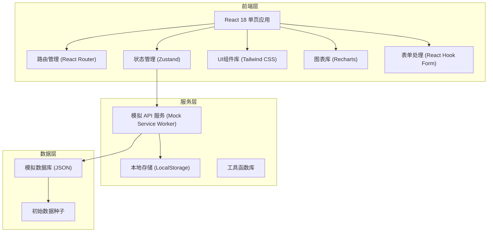
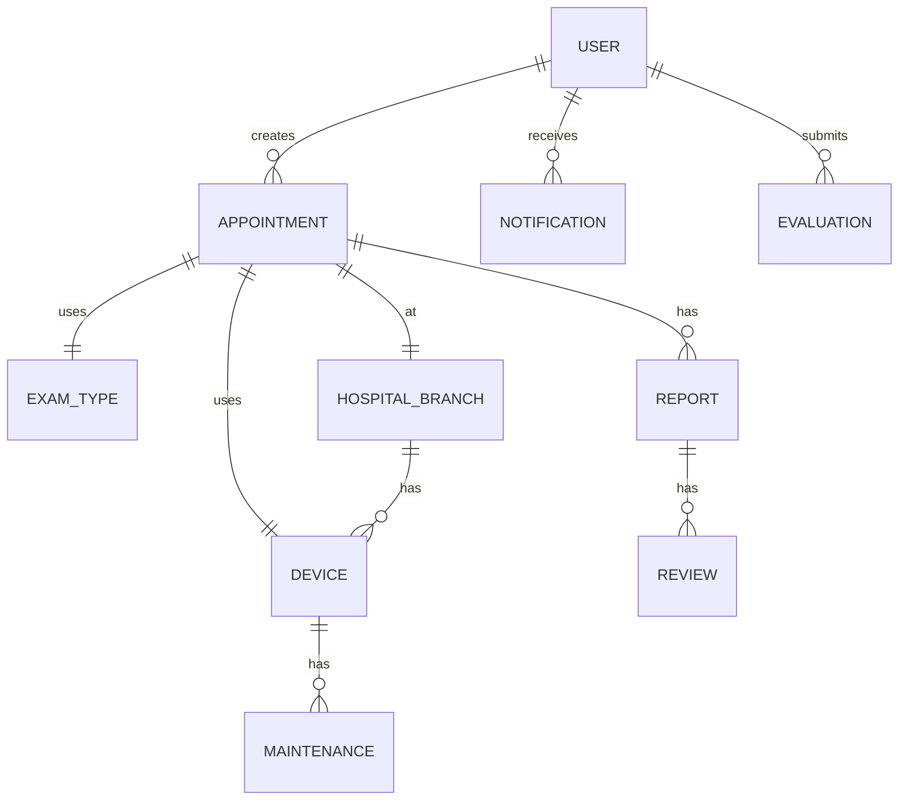

## 1. 架构设计



## 2. 技术描述

- **前端框架**：React 18 + TypeScript
- **构建工具**：Vite 5.0
- **样式方案**：Tailwind CSS 3.4
- **路由管理**：React Router Dom 6.20
- **状态管理**：Zustand 4.4
- **图表库**：Recharts 2.10
- **表单处理**：React Hook Form 7.48
- **图标库**：Lucide React 0.294
- **日期处理**：date-fns 2.30
- **UI动画**：Framer Motion 10.16
- **数据模拟**：Mock Service Worker + 本地JSON数据

## 3. 路由定义

| 路由路径 | 页面名称 | 角色权限 |
|----------|----------|----------|
| /login | 登录页 | 公开 |
| /patient | 患者首页 | 患者 |
| /patient/appointment | 预约检查 | 患者 |
| /patient/appointments | 我的预约 | 患者 |
| /patient/reports | 报告中心 | 患者 |
| /patient/evaluate | 满意度评价 | 患者 |
| /doctor | 医生首页 | 开单医生 |
| /doctor/appointments | 预约列表 | 开单医生 |
| /doctor/patient/:id | 患者详情 | 开单医生 |
| /technician | 技师首页 | 检查技师 |
| /technician/queue | 检查队列 | 检查技师 |
| /technician/report/:id | 报告上传 | 检查技师 |
| /director | 主任首页 | 科室主任 |
| /director/devices | 设备监控 | 科室主任 |
| /director/capacity | 容量设置 | 科室主任 |
| /director/satisfaction | 满意度排名 | 科室主任 |
| /admin | 院领导首页 | 院领导 |
| /admin/overview | 全局概览 | 院领导 |
| /admin/reports | 运营报告 | 院领导 |
| /notifications | 通知中心 | 所有登录用户 |

## 4. 数据模型

### 4.1 实体关系图



### 4.2 核心数据结构

```typescript
// 用户
interface User {
  id: string;
  name: string;
  role: 'patient' | 'doctor' | 'technician' | 'director' | 'admin';
  phone: string;
  idCard?: string;
  employeeId?: string;
  department?: string;
  avatar?: string;
}

// 检查类型
interface ExamType {
  id: string;
  name: string;
  category: string;
  duration: number; // 分钟
  price: number;
  description: string;
}

// 院区
interface HospitalBranch {
  id: string;
  name: string;
  address: string;
  phone: string;
}

// 设备
interface Device {
  id: string;
  name: string;
  model: string;
  branchId: string;
  examTypeIds: string[];
  status: 'available' | 'busy' | 'maintenance';
  dailyCapacity: number;
}

// 预约
interface Appointment {
  id: string;
  patientId: string;
  patientName: string;
  doctorId: string;
  doctorName: string;
  examTypeId: string;
  examTypeName: string;
  branchId: string;
  branchName: string;
  deviceId: string;
  date: string;
  timeSlot: string;
  status: 'pending' | 'confirmed' | 'urgent' | 'processing' | 'completed' | 'cancelled';
  isUrgent: boolean;
  queuePosition: number;
  createdAt: string;
}

// 报告
interface Report {
  id: string;
  appointmentId: string;
  technicianId: string;
  technicianName: string;
  images: string[];
  findings: string;
  impression: string;
  reviewerId?: string;
  reviewerName?: string;
  status: 'draft' | 'pending_review' | 'reviewed' | 'rejected';
  submittedAt: string;
  reviewedAt?: string;
}

// 评价
interface Evaluation {
  id: string;
  appointmentId: string;
  technicianId: string;
  score: number; // 1-5
  comment?: string;
  createdAt: string;
}

// 通知
interface Notification {
  id: string;
  userId: string;
  type: 'appointment' | 'urgent' | 'report' | 'review' | 'system';
  title: string;
  content: string;
  relatedId?: string;
  isRead: boolean;
  createdAt: string;
}

// 运营报告
interface OperationReport {
  id: string;
  month: string;
  branchStats: BranchStats[];
  totalExams: number;
  avgWaitTime: number;
  recheckRate: number;
  deviceFailures: number;
  totalRevenue: number;
  generatedAt: string;
}

interface BranchStats {
  branchId: string;
  branchName: string;
  examCount: number;
  avgWaitTime: number;
  deviceUtilization: number;
  cancellationRate: number;
}
```

## 5. 项目目录结构

```
src/
├── assets/              # 静态资源
│   ├── images/
│   └── icons/
├── components/          # 公共组件
│   ├── layout/          # 布局组件
│   ├── ui/              # 基础UI组件
│   └── charts/          # 图表组件
├── pages/               # 页面组件
│   ├── Login/
│   ├── Patient/
│   ├── Doctor/
│   ├── Technician/
│   ├── Director/
│   ├── Admin/
│   └── Notifications/
├── store/               # 状态管理
│   ├── useAuthStore.ts
│   ├── useAppointmentStore.ts
│   ├── useNotificationStore.ts
│   └── index.ts
├── services/            # API服务
│   ├── api.ts
│   ├── auth.ts
│   ├── appointment.ts
│   ├── report.ts
│   └── statistics.ts
├── types/               # 类型定义
│   └── index.ts
├── utils/               # 工具函数
│   ├── date.ts
│   ├── scheduler.ts     # 智能调度算法
│   └── validator.ts
├── data/                # 模拟数据
│   ├── mockUsers.ts
│   ├── mockAppointments.ts
│   ├── mockReports.ts
│   └── mockStatistics.ts
├── hooks/               # 自定义Hooks
│   ├── useAuth.ts
│   ├── useNotifications.ts
│   └── useScheduler.ts
├── App.tsx
├── main.tsx
└── index.css
```

## 6. 核心算法说明

### 6.1 智能院区推荐算法
- 输入：检查类型ID、患者偏好院区（可选）
- 输出：按推荐度排序的院区列表及可用时间段
- 算法逻辑：
  1. 筛选支持该检查类型的院区
  2. 计算各院区综合评分：
     - 设备可用率（40%权重）
     - 平均排队时长（30%权重）
     - 距离/交通便利性（20%权重，模拟数据）
     - 患者历史偏好（10%权重）
  3. 返回Top 3推荐院区及每个院区的可用时间段

### 6.2 急诊插队算法
- 插入位置：队列中前10%位置（但至少第2位）
- 重新排序：标记急诊后，立即重新计算队列排序
- 通知机制：插队后立即推送通知给对应技师

### 6.3 报告完整性校验
- 必选字段检查：检查所见、诊断印象、至少1张影像
- 格式校验：影像格式、文字长度
- 自动标记：不完整的报告禁止提交审核
